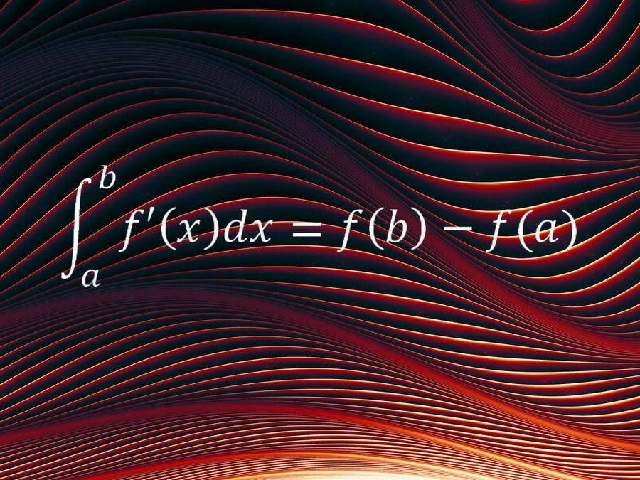
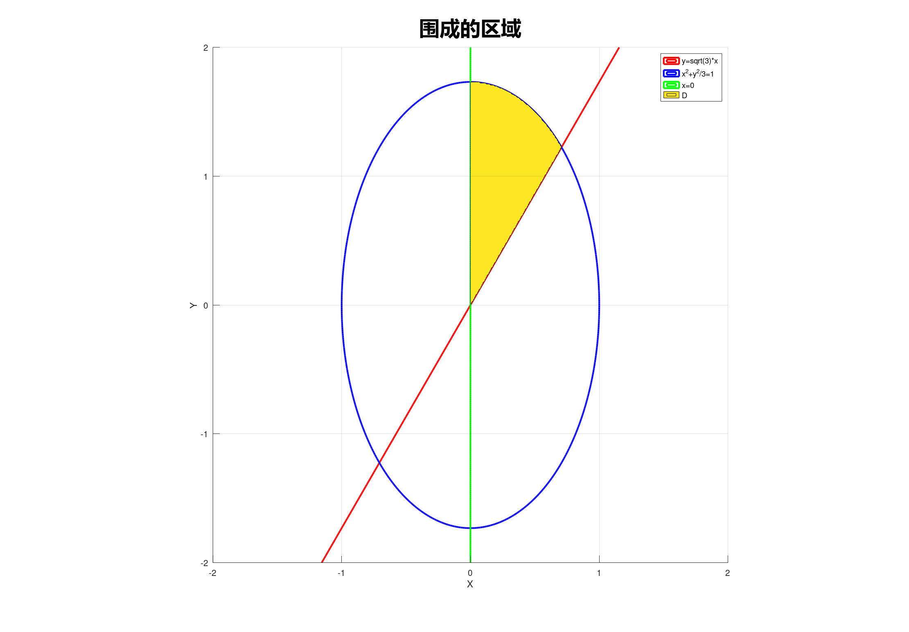

||
|:--:|
| 封面：牛顿-莱布尼茨公式 |

---

**平面区域D是由 $x=0$, $y=\sqrt{3(1-x^2)}$, $y=\sqrt{3}x$ 围成的，求二重积分 $I= \iint \limits_D x^2 \mathrm{d}x \mathrm{d}y$。**
||
|:--:|
| 黄色部分是平面区域D |

黄色部分是平面区域D。先对y积分，上下界是椭圆和直线方程。再对x积分，上下界是$0$到$\frac{\sqrt{2}}{2}$。
```matlab
% 通用方法，适用于各种方程
figure;
hold on;

% 创建网格
[x, y] = meshgrid(linspace(-2, 2, 500));

% 定义三个方程
f1 = sqrt(3) .* x - y; % 直线y = sqrt(3) * x
f2 = x.^2 + y.^2/3 - 1; % 椭圆: x^2/9 + y^2/4 = 1
f3 = x;             % 直线 x = 0

% 绘制等高线（方程曲线）
contour(x, y, f1, [0 0], 'r-', 'LineWidth', 2);  % f1=0
contour(x, y, f2, [0 0], 'b-', 'LineWidth', 2);  % f2=0
contour(x, y, f3, [0 0], 'g-', 'LineWidth', 2);  % f3=0

% 填充满足所有不等式的区域
% 例如：在f1以上、f2椭圆内、f3右侧的区域
region = (f1 <= 0) & (f2 <= 0) & (f3 >= 0);
contourf(x, y, double(region), [0.5 0.5], 'FaceColor', 'cyan', 'FaceAlpha', 0.3);

grid on;
axis equal;
xlim([-2, 2]);
ylim([-2, 2]);
xlabel('x');
ylabel('y');
title('三个方程围成的区域');
legend('x^2+y^2=4', 'x^2/9+y^2/4=1', 'y=x^2', 'D');
legend on;

hold off;
```
$\begin{aligned}
I 
&= \int_0^{\frac{\sqrt{2}}{2}} \mathrm{d}x \int_{\sqrt{3}x}^{\sqrt{3(1-x^2)}} x^2 \mathrm{d}y \\
&= \sqrt{3} (\int_0^{\frac{\sqrt{2}}{2}} x^2\sqrt{1-x^2} \mathrm{d}x- \int_x^{\frac{\sqrt{2}}{2}}x^3 \mathrm{d}x) \\
&= \sqrt{3}(I_1-I_2)
\end{aligned}$

$\begin{aligned}
I_1
&\xlongequal{\quad x=\sin\theta\quad} \int_0^\frac{\pi}{4} \sin^2\theta \cos^2\theta  \mathrm{d}\theta \\
&= \frac{1}{4} \int_0^\frac{\pi}{4} \sin^2 2\theta \mathrm{d}\theta \\
&= \frac{1}{8} \int_0^\frac{\pi}{4} 1-\cos 4\theta \mathrm{d}\theta \\
&= \left.{\frac{1}{8}(\theta-\frac{1}{4}\sin 4\theta)} \right|_0^1 \\
&= \frac{\pi}{32}
\end{aligned}$

$\begin{aligned}
I_2 = \left.{\frac{1}{4}x^4} \right|_0^{\frac{\sqrt{2}}{2}} = \frac{1}{16}
\end{aligned}$

$\begin{aligned}
I&= \sqrt{3}(I_1-I_2)\\
&= \sqrt{3}(\frac{\pi}{32}-\frac{1}{16})\\
&= \frac{\sqrt{3}(\pi-2)}{32}
\end{aligned}$

---

**计算二重积分$I= \int_0^\pi \int_0^x \frac{\sin t}{\pi-t} \mathrm{d}t \mathrm{d}x$**
$\begin{aligned}
I
&= \int_x^\pi \int_0^x \frac{\sin t}{\pi-t} \mathrm{d}t \mathrm{d}x \\
&= \int_0^\pi \mathrm{d}t \int_t^\pi \frac{\sin t}{\pi-t} \mathrm{d}x \\
&= \int_0^\pi \mathrm{d}t \left.\frac{\sin t}{\pi-t}x \right|_t^\pi \\
&= \int_0^\pi \mathrm{d}t \frac{\sin t}{\pi-t} \times (\pi-t) \\
&= \int_0^\pi \sin t \mathrm{d}t \\
&= \left.-\cos t \right|_0^\pi \\
&= 2
\end{aligned}$

---
